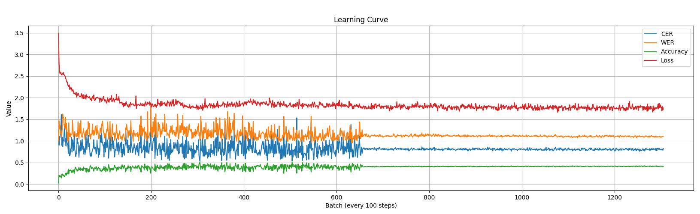
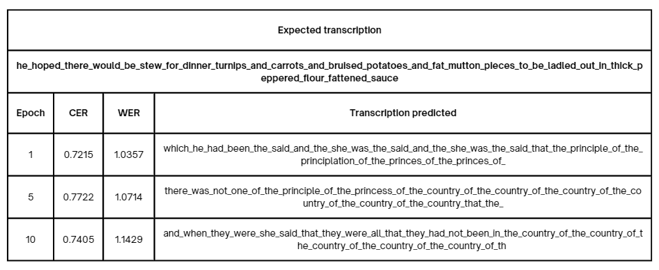

# SpeechTransformer-Pytorch

**Description:**  

This repository contains the source code of an [SpeechTransformer](https://sci-hub.se/downloads/2020-09-03/63/dong2018.pdf) in Pytorch, done for the discipline of Deep Learning from 2024-2 UFV.

---

## Table of Contents
1. [Environment Configuration](#environment-configuration)
2. [Dataset](#dataset)
3. [Scripts](#scripts)
4. [Model Summary](#model-summary)
5. [Results](#results)

---

## Environment Configuration

### 1. Create the Virtual Environment
```bash
python -m venv venv
```

### 2. Activate the Virtual Environment
```bash
# For Windows:
venv\Scripts\Activate

# For MacOS/Linux:
source venv/bin/activate
```

### 3. Install Dependencies
```bash
pip install -r requirements.txt
```

OBS: You also may need to install seperate dependencies, like CUDA for GPU use and ffmpeg for audio conversion.

---

## Dataset

This project used the [LibriSpeech](https://www.danielpovey.com/files/2015_icassp_librispeech.pdf) dataset. 

If you want to run this project, you need to follow these steps to prepare the dataset correctly.
1. Download the datasets at [LibriSpeech](https://www.openslr.org/12) and put them (train-clean-100, dev-other...) inside the LibriSpeech folder.   
2. Open a terminal inside the LibriSpeech folder.  
3. Run the following script to convert the dataset from .flac to .wav.
     ```bash
    python flac2wav.py
    ```
    - **Note:** If you want to preserve the .flac files you need to comment the line 20 of this file.
4. Run the following script to gather all the transcriptions from the different datasets folders. At the end of it, you'll have .txt files inside the folder **data** with pairs of (id transcription), one for each dataset.
     ```bash
    python gather_transcriptions.py
    ```
---

## Scripts
To train and evaluate the Speech-Transformer model, use the following commands:

### Training the Model
Run the train_transformer.py script to train the Speech-Transformer model.
```bash
python train_transformer.py
```

### Evaluating the Model
Run the evaluate_transformer.py script to evaluate the trained model on the test dataset. Adjust the path for the model weights as necessary.
```bash
python evaluate_transformer.py
```

---

## Model Summary
```
===========================================================================                               
Layer (type:depth-idx)                             Param #                                                
===========================================================================
SpeechTransformer                                  --
├─Pre_Net: 1-1                                     --
│    └─Conv2d: 2-1                                 1,792
│    └─BatchNorm2d: 2-2                            128
│    └─Conv2d: 2-3                                 36,928
│    └─BatchNorm2d: 2-4                            128
│    └─ModuleList: 2-5                             --
│    │    └─TwoD_Attention_layer: 3-1              259,200
│    │    └─TwoD_Attention_layer: 3-2              259,200
├─Transformer: 1-2                                 --
│    └─Encoder: 2-6                                --
│    │    └─Linear: 3-3                            327,936
│    │    └─LayerNorm: 3-4                         512
│    │    └─Dropout: 3-5                           --
│    │    └─ModuleList: 3-6                        6,318,080
│    └─Decoder: 2-7                                --
│    │    └─Embedding: 3-7                         7,936
│    │    └─ModuleList: 3-8                        4,213,760
│    │    └─Linear: 3-9                            7,967
===========================================================================
Total params: 11,433,567
Trainable params: 11,433,567
Non-trainable params: 0
===========================================================================
```

**Note:** For simplification, all the hyperparameters were defined directely in the files. If you want to change them, you'll need to change the files manually.

---

## Results

### Learning Curve (10 epochs on train-clean-360 with batch_size=8)


### Evaluation Sample

